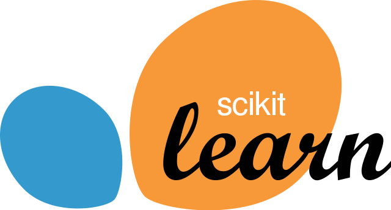

## Ola! Sou Lucas Luiz, seja bem-vindo!

  
  

## 

  
  
   <h1 align="center">Linguagens</h1>
   
    
    
    

     
    <h1 align="center">Frameworks</h1>
    
    
    
    
    

   
  <h1 align="center">Redes Sociais</h1>
  
   
  
 

 

